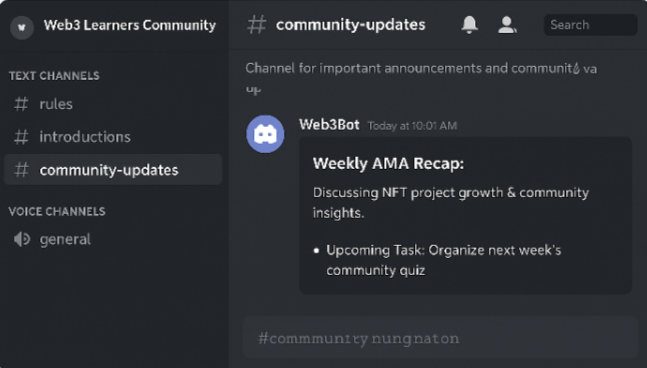

# 🌐 Web3 Community Dummy Project

### 🎯 Tujuan
Proyek simulasi ini dibuat oleh **K-SpectraZero** untuk menampilkan *real-world skill* dalam membangun, mengelola, dan menganalisis komunitas Web3.  
Fokus utama adalah praktik komunikasi digital, engagement, dokumentasi, dan manajemen komunitas seperti yang dilakukan oleh *Community Manager profesional di ekosistem Web3.*

---

## 🧩 Struktur Komunitas
| Role | Tanggung Jawab | Tools yang Digunakan |
|------|-----------------|----------------------|
| 🛠️ Admin | Mengatur struktur server, peran, & channel Discord | Discord, Notion |
| 💬 Moderator | Mengawasi diskusi & menjaga etika komunitas | Discord Roles, Mod Logs |
| 🔍 Researcher | Membagikan insight & analisis Web3 | Medium, Google Docs |
| 👥 Member | Berpartisipasi dalam diskusi & event mingguan | Discord |

---

## ⚙️ Fitur & Aktivitas
- 🪩 **Weekly Discussion:** topik tentang NFT, blockchain, dan tokenomics  
- 📊 **Research Thread:** riset proyek Web3 yang sedang tren  
- 🧠 **Learning Post:** tulisan edukatif mingguan tentang DAO, DeFi, atau Web3 governance  
- 🎙️ **Community Voice Chat:** simulasi event *“Open Talk”* untuk meningkatkan engagement  
- 🏅 **Achievement Role System:** sistem peran untuk anggota aktif (auto level system)

---

## 📸 Screenshot Aktivitas
Contoh tampilan simulasi komunitas Discord (dummy server):  

---

## 🧾 Activity Log
📘 Lihat catatan lengkap aktivitas mingguan di bawah ini 👇  

### 📆 Catatan Lengkap Aktivitas Mingguan
| Tanggal | Aktivitas | Status |
|----------|------------|--------|
| 20 Okt 2025 | Membuat struktur awal server Discord & role sistem | ✅ |
| 21 Okt 2025 | Mendesain README.md profesional untuk GitHub | ✅ |
| 22 Okt 2025 | Upload screenshot dummy server Discord | ✅ |
| 23 Okt 2025 | Membuat *activity-log.md* untuk dokumentasi mingguan | ✅ |
| 24 Okt 2025 | Review keseluruhan proyek & update final | ✅ |

📸 Dokumentasi visual aktivitas minggu ini:  

---

## 🧭 Insight Pribadi
> “Membangun komunitas Web3 bukan hanya tentang angka, tapi tentang bagaimana menciptakan **trust, komunikasi, dan sense of belonging.**  
> Simulasi ini membantu saya memahami dinamika komunitas digital secara realistis.”

— **K-SpectraZero**

---

## 🛠️ Tools & Stack
- **Platform:** Discord, GitHub, Notion  
- **Documentasi:** Markdown, Google Docs  
- **Analitik:** Engagement observation, poll metrics  
- **Tujuan Akhir:** Portofolio realistis untuk posisi *Community Manager / Web3 Researcher.*

---

## 🧩 Catatan Akhir
Proyek ini merupakan *dummy project* non-komersial untuk membangun portofolio dan mempraktikkan manajemen komunitas Web3 secara realistis.

---

© 2025 — *Created by [K-SpectraZero](https://github.com/Spectra-zero)* ⚡
